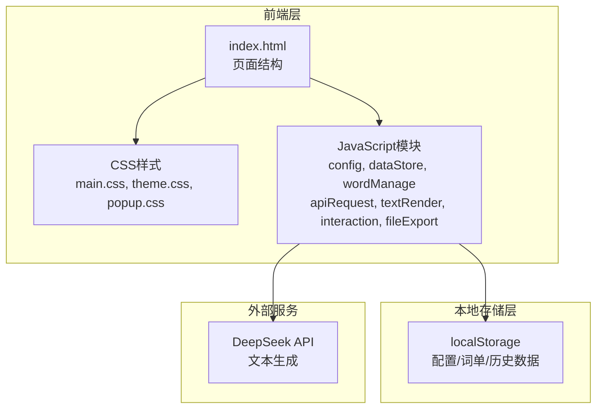

# 单词段落生成工具 - 技术架构文档

## 1. 架构设计



## 2. 技术栈说明

| 层级 | 技术选型 | 说明 |
|------|----------|------|
| 前端框架 | 无框架（原生JS） | 纯前端实现，无Vue/React |
| 样式 | CSS3 + Flex/Grid | 响应式布局，主题切换 |
| 存储 | localStorage | 配置、词单、历史数据持久化 |
| 网络请求 | fetch API | 调用DeepSeek API |
| 文件导出 | Blob + download | 本地TXT文件生成下载 |

## 3. 项目目录结构

```
vocab-reading-generator/
├── index.html            # 项目唯一入口页面
├── css/
│   ├── main.css          # 全局布局、基础样式、响应式适配
│   ├── theme.css         # 亮色/暗色两套主题样式
│   └── popup.css         # 单词下拉卡片、弹窗样式
├── js/
│   ├── config.js         # 全局配置读写、API配置、样式配置持久化
│   ├── dataStore.js      # 本地数据存储、历史记录、词单数据管理
│   ├── wordManage.js     # 单词导入、解析、去重、分组、状态标记
│   ├── apiRequest.js     # DeepSeek API封装、请求、异常捕获、Prompt管理
│   ├── textRender.js     # 文本渲染、单词高亮、段落拆分、版本管理
│   ├── interaction.js    # 单词点击交互、卡片/弹窗展开收起逻辑
│   └── fileExport.js     # 本地文件导出、自动命名
└── assets/               # 静态资源（预留）
```

## 4. 模块职责定义

### 4.1 config.js - 配置管理模块

| 函数/方法 | 功能描述 |
|-----------|----------|
| `loadConfig()` | 从localStorage加载全局配置 |
| `saveConfig(key, value)` | 保存配置项到localStorage |
| `getApiConfig()` | 获取API配置（地址、密钥、超时） |
| `setApiConfig(config)` | 设置API配置 |
| `getTheme()` | 获取当前主题（亮色/暗色） |
| `setTheme(theme)` | 设置主题 |
| `getHighlightStyle()` | 获取高亮样式设置 |
| `setHighlightStyle(style)` | 设置高亮样式 |
| `testApiConnection()` | 测试API连接可用性 |

### 4.2 dataStore.js - 数据存储模块

| 函数/方法 | 功能描述 |
|-----------|----------|
| `loadWordList()` | 加载当日词单数据 |
| `saveWordList(data)` | 保存词单数据 |
| `loadHistory()` | 加载历史记录列表 |
| `saveHistory(data)` | 保存历史记录 |
| `loadCurrentText()` | 加载当前文本 |
| `saveCurrentText(text)` | 保存当前文本 |
| `clearTodayWords()` | 清空当日词单 |
| `getHistoryByDate(date)` | 按日期获取历史记录 |

### 4.3 wordManage.js - 单词管理模块

| 函数/方法 | 功能描述 |
|-----------|----------|
| `parseWords(input)` | 解析输入文本为单词列表（空格/换行分割） |
| `removeDuplicates(words)` | 去除重复单词 |
| `addWord(word, group)` | 添加单词到指定分组 |
| `removeWord(word)` | 删除单词 |
| `updateWordDetail(word, detail)` | 更新单词释义/词性 |
| `setWordStatus(word, status)` | 设置单词状态标记 |
| `filterWordsByGroup(group)` | 按分组筛选单词 |
| `filterWordsByStatus(status)` | 按状态筛选单词 |
| `getWordCount()` | 获取单词统计 |

### 4.4 apiRequest.js - API请求模块

| 函数/方法 | 功能描述 |
|-----------|----------|
| `generateText(words, mode)` | 调用API生成文本 |
| `buildPrompt(words, mode)` | 构建请求Prompt |
| `handleApiError(error)` | 处理API异常 |
| `parseApiResponse(response)` | 解析API返回内容 |

**内置Prompt模板**：
```
请根据以下要求生成阅读段落：

1. 必须将以下所有单词完整融入文本：[单词列表]
2. 单词释义优先使用考研高频释义，并标注单词在当前句子中使用的具体释义
3. 单词总量最大250个，自动拆分多篇独立短文（贴合考研阅读篇幅）
4. 遇到极生僻单词：简化句式保证通顺，在文本末尾单独汇总展示生僻词
5. 保证全文语法正确、逻辑连贯，风格贴近考研英语阅读

生成模式：[纯英文段落/中文主线叙事]
```

### 4.5 textRender.js - 文本渲染模块

| 函数/方法 | 功能描述 |
|-----------|----------|
| `renderText(text)` | 渲染文本到展示区 |
| `highlightWords(text, words)` | 高亮标记单词 |
| `splitParagraphs(text)` | 拆分段落 |
| `renderPagination(paragraphs)` | 分页展示 |
| `collectRareWords(text)` | 收集生僻词 |
| `renderRareWords(words)` | 渲染生僻词汇总 |
| `incrementVersion()` | 版本号累加 |
| `copyText()` | 一键复制文本 |

### 4.6 interaction.js - 交互模块

| 函数/方法 | 功能描述 |
|-----------|----------|
| `initWordClick()` | 初始化单词点击事件 |
| `showSimpleCard(word, element)` | 展示简易卡片 |
| `hideSimpleCard()` | 收起简易卡片 |
| `showDetailPopup(word)` | 展示详情弹窗 |
| `hideDetailPopup()` | 关闭详情弹窗 |
| `handleBlankClick()` | 处理空白区域点击（收起卡片） |

### 4.7 fileExport.js - 文件导出模块

| 函数/方法 | 功能描述 |
|-----------|----------|
| `exportToFile(data)` | 导出数据为TXT文件 |
| `generateFileName()` | 生成文件名（年月日_复习词+新词_版本号.txt） |
| `downloadFile(content, filename)` | 触发文件下载 |

## 5. 数据模型定义

### 5.1 配置数据模型

```javascript
const configModel = {
  api: {
    url: 'https://api.deepseek.com/v1/chat/completions',
    key: '',
    timeout: 30000
  },
  theme: 'light', // 'light' | 'dark'
  highlightStyle: 'background', // 'bold' | 'background' | 'color'
  savePath: '',
  defaultMode: 'english', // 'english' | 'chinese'
  lastSettings: {}
};
```

### 5.2 词单数据模型

```javascript
const wordListModel = {
  date: '2026-06-14',
  reviewWords: [], // 复习词列表
  newWords: [], // 新词列表
  wordDetails: {
    // 单词详情
    'word': {
      translation: '考研释义',
      pos: 'n.',
      status: '待复习', // '已掌握' | '待复习' | '难点词'
      phonetic: '',
      fullTranslation: ''
    }
  }
};
```

### 5.3 历史记录数据模型

```javascript
const historyModel = {
  records: [
    {
      date: '2026-06-14',
      totalWords: 250,
      reviewCount: 125,
      newCount: 125,
      versions: [
        {
          version: 1,
          text: '生成的文本内容',
          rareWords: ['生僻词列表'],
          mode: 'english'
        }
      ]
    }
  ]
};
```

## 6. API接口定义

### 6.1 DeepSeek API请求格式

```javascript
const apiRequest = {
  url: 'https://api.deepseek.com/v1/chat/completions',
  method: 'POST',
  headers: {
    'Content-Type': 'application/json',
    'Authorization': 'Bearer [API_KEY]'
  },
  body: {
    model: 'deepseek-chat',
    messages: [
      {
        role: 'system',
        content: '你是一位专业的考研英语教师...'
      },
      {
        role: 'user',
        content: '[Prompt内容]'
      }
    ],
    temperature: 0.7,
    max_tokens: 4000
  }
};
```

### 6.2 API响应处理

```javascript
const apiResponse = {
  success: true,
  data: {
    text: '生成的文本内容',
    rareWords: ['生僻词列表']
  },
  error: null
};
```

## 7. 响应式布局断点

| 设备类型 | 断点范围 | 布局方式 |
|----------|----------|----------|
| 大屏幕电脑 | > 1200px | 三栏并排布局 |
| 中等屏幕 | 768px - 1200px | 三栏压缩布局 |
| 手机端 | < 768px | 单栏布局，区域上下排列 |

## 8. 性能优化策略

| 优化项 | 实现方式 |
|--------|----------|
| 文本渲染 | 分页加载，避免一次性渲染大量文本 |
| 单词匹配 | 使用正则表达式批量匹配，避免逐词遍历 |
| 历史记录 | 懒加载，点击时才加载详细内容 |
| API请求 | 超时控制，loading状态提示 |
| localStorage | 数据压缩，避免存储过大内容 |

## 9. 安全考虑

| 安全项 | 处理方式 |
|--------|----------|
| API密钥存储 | 存储在localStorage，用户自行保管 |
| 数据隐私 | 所有数据本地存储，不上传服务器 |
| XSS防护 | 文本渲染时进行HTML转义 |
| 输入验证 | 单词导入时验证格式，过滤非法字符 |